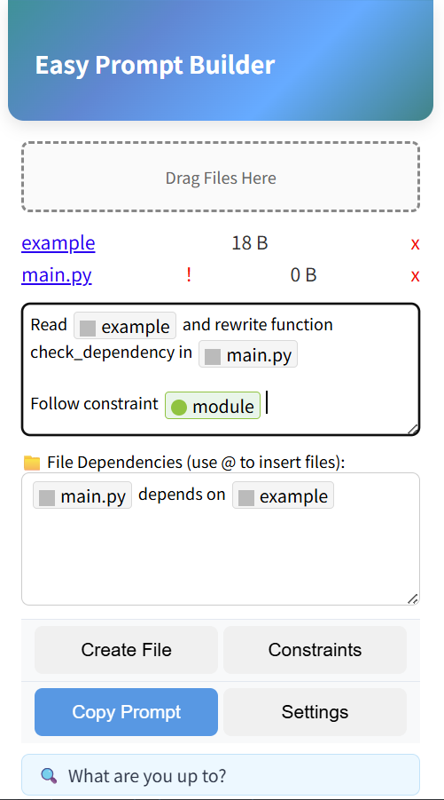
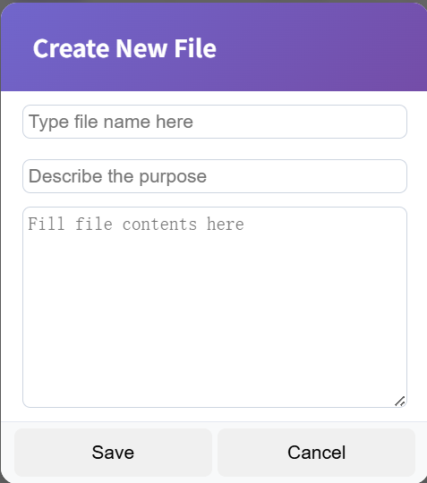
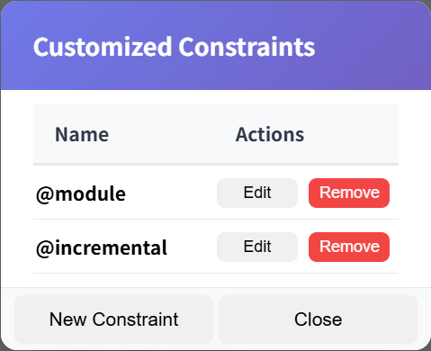
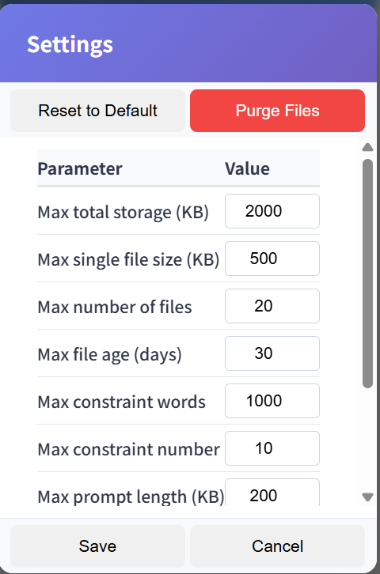

# Easy Prompt Builder (EZ-prob) 🧩

> Enjoy a smooth coding-quality chat experience with free AI chat tools — without paying for expensive coding agents.

**Easy Prompt Builder (EZ-prob)** is a lightweight Chrome extension that helps you **organize, structure, and pack complex prompts** for large language models (LLMs), especially when you are using **free chat interfaces** such as ChatGPT, Gemini, DeepSeek, and similar tools.

It is particularly useful for **coding and technical tasks**, where you need to provide:
- multiple files,
- clear requirements,
- strict constraints,
- and explicit dependency relationships,

all in a way that LLMs can understand **reliably and consistently**.

---

## Why EZ-prob? 🤔

Modern coding agents are powerful — but often expensive.

If you:
- prefer not to subscribe to paid coding agents,
- want to fully utilize the **free quota** of chat-based AI tools,
- and still aim for **high-quality, agent-like outputs**,

then **prompt structure becomes critical**.

EZ-prob does **not** generate content for you.  
Instead, it helps you **systematically reorganize your own information** — files, requirements, constraints, and dependencies — into a prompt layout that LLMs handle best.

Think of EZ-prob as a **prompt packer**:
- you provide the content,
- EZ-prob optimizes the *structure* and *logic*,
- you copy & paste the result into any AI chat.

No magic. No hidden behavior. Full control.

---

## Key Features ✨

- 🧩 **Browser-only Chrome extension**  
  No external installation, no CLI tools, no setup overhead.

- 🔒 **100% local & privacy-first**  
  - No remote servers  
  - No network requests  
  - No background workers  
  - No access to browsing history  
  - Activated only when you open it  

- 💾 **Local-first data storage**  
  All files and metadata stay on your own machine.

- 🧱 **Clear information blocks**  
  Explicit separation of objectives, constraints, dependencies, and code.

- ⚡ **Designed for reuse & iteration**  
  Reuse constraints, selectively include files, and quickly rebuild prompts.

---

## How It Works 🛠️

EZ-prob organizes your input into a proven, LLM-friendly template:

```txt
I need you to rewrite the target file based on the structure and logic of the reference files.
Below are the task description, constraints, and the complete content of all files.

===========================
【TASK OBJECTIVE】
===========================

[Your main requirements]

===========================
【CONSTRAINTS THAT MUST BE SATISFIED】
===========================

[Constraint 1]
[Constraint 2]
...

===========================
【DEPENDENCY RELATIONSHIPS BETWEEN FILES】
===========================

[Dependency description]

===========================
【ATTACHED FILE CONTENTS】
===========================

Below I will provide the content of each file one by one.

[File content 1]
[File content 2]
...

(All attached files end here)
````

### Why this structure works

* Clear separation between **natural language** and **code**
* Explicit markers and section boundaries
* Requirements and constraints appear **before** large code blocks
* Important context is placed upfront, reducing model confusion

You never need to manually format this.
EZ-prob assembles it automatically based on your inputs.

---

## Installation 🚀

```bash
git clone <your-git-repo-url>
```

1. Open Chrome and navigate to:

   ```
   chrome://extensions
   ```
2. Enable **Developer mode**
3. Click **Load unpacked**
4. Select the project folder

That’s it.

---

## How to Use 📘

### Open the Extension

Click the EZ-prob icon in your browser toolbar to open the main panel.



*Fig. 1 Main panel of EZ-prob*

---

### 1. Define Requirements

* Use the **first text box** to describe your main objective:

  * What do you want the AI to do?
  * A script, a module, a refactor, a bug fix?

* Type `@` to trigger suggestions for:

  * uploaded **files**
  * predefined **constraints**

* Navigate with ↑ ↓ and confirm with `Enter`.

---

### 2. Upload Files

* Drag files into the **Drag zone**, or click **Create File** to add them manually.
* Uploaded files appear in the list below (See Fig. 1).

    
    
    *Fig. 2 Create file dialog*

**File indicators:**

* A red `!` means the file lacks a description.
* Click the filename to edit its description.
* Adding descriptions significantly improves model understanding.

**Important behavior:**

* Uploading a file does **not** automatically include it in the final prompt.
* You must explicitly reference it using `@filename`.
* This allows you to:

  * mention key files early,
  * and keep full code content at the end.

**Privacy & storage:**

* Files are stored locally in Chrome’s cache.
* No uploads. No servers. No tracking.
* Files have a configurable lifetime and are automatically purged.

---

### 3. Create Constraints

* Constraints describe *how* the task must be performed.
* Open the **Constraints** panel to create, edit, or delete them.

    

    *Fig. 3 Constraint panel*

Guidelines:

* Keep constraints **short and precise**
* Each constraint is referenced using `@constraint_name`
* Avoid using `@` inside constraint names

Like files, constraints are **only included when explicitly referenced**.

---

### 4. Describe Dependencies

* Use the **second text box** to explain relationships between files.
* You can also use `@` here to reference files or constraints.

---

### 5. Copy the Prompt

* Click **Copy Prompt**
* Paste it directly into your AI chat interface

---

### 6. Settings

* Configure file lifetime and other behaviors
* No permissions beyond what is strictly necessary
    
    
    
    *Fig. 4 Settings panel*

---

## Design Rationale & Philosophy 🧠

EZ-prob is intentionally minimal and opinionated.

* **Local-first & privacy-first**
  No data ever leaves your machine.

* **Simple, direct UI**
  No feature bloat. No unnecessary abstraction.

* **For free AI users**
  Designed specifically for users who rely on free chat interfaces.

* **Zero content injection**
  The final prompt contains *only* your information.

* **Full transparency**
  No sensitive permissions. No hidden access.

---

## Notes & Limitations ⚠️

* EZ-prob is a **prompt packer**, not a prompt generator
* Only text files are supported (no binaries or images)
* AI behavior is probabilistic — results are not guaranteed

---

## Contributing 🤝

Issues and pull requests are welcome.
Bug reports, feature ideas, and documentation improvements are all appreciated.

---

## License 📄

MIT License — free to use, modify, and distribute.

> 🤖 Enjoy free AI services.